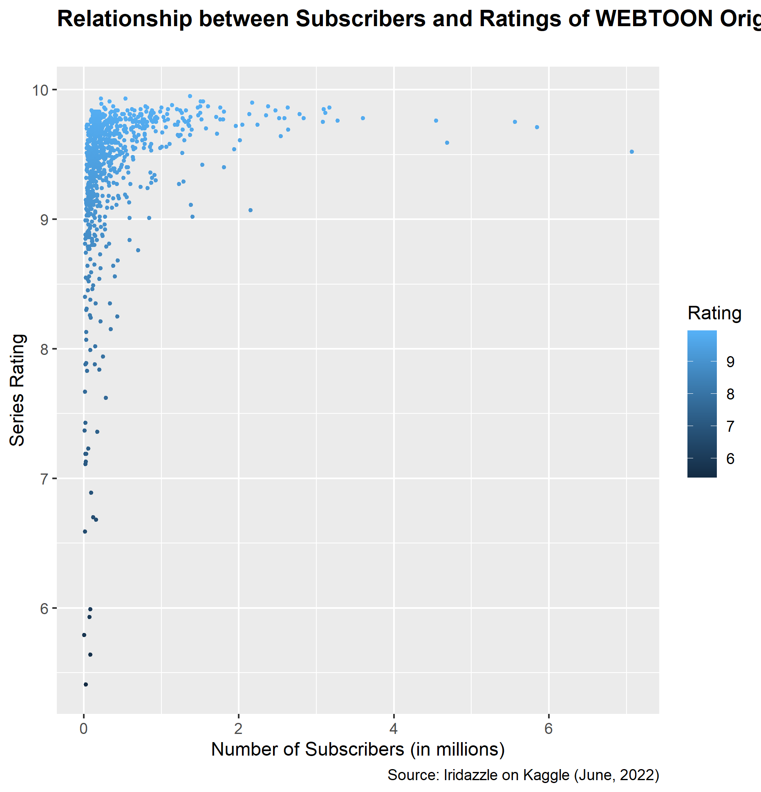
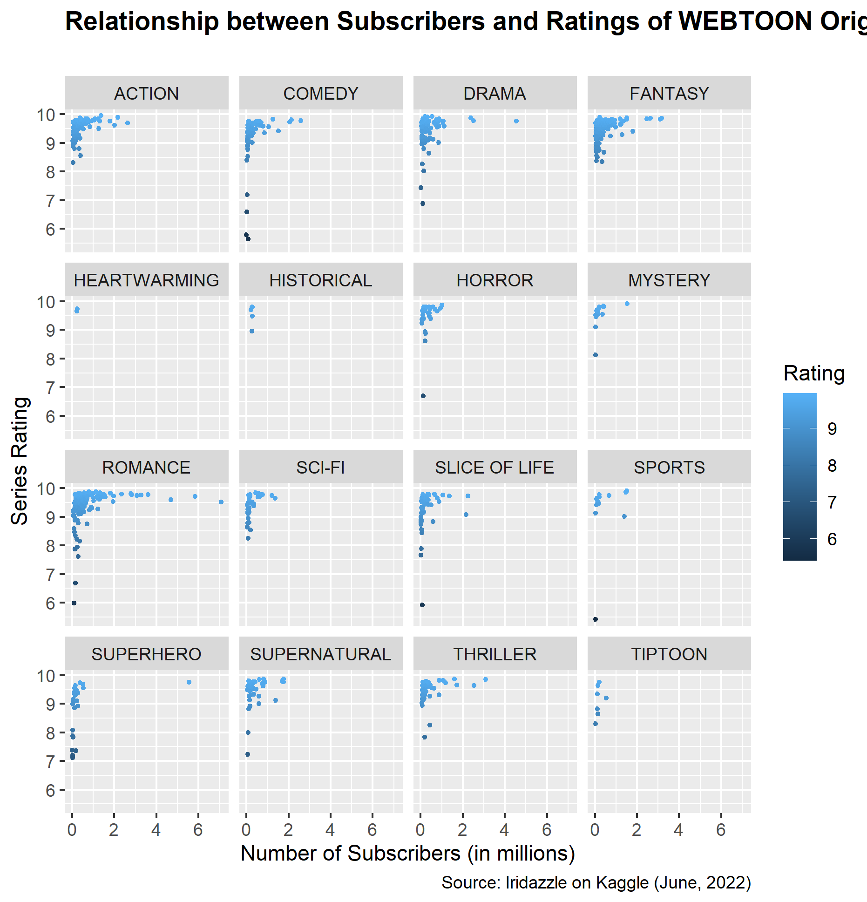

```{r setup, include=FALSE}
knitr::opts_chunk$set(echo = FALSE)
library(knitr)
```

## **Metrics of Success**
Though cut-and-dry figures are not necessarily an indicator of a "good" WEBTOON, data analysis can identify patterns in Originals that statistically perform well among readers.

The follow metrics of success are compared to variables such as genre throughout this project:

* Number of subscribers
* Rating


## Genres and Popularity
```{r}
include_graphics("genre_ratings.png")
```


Average series ratings are about the same for Originals across all genres, with Originals from the Heartwarming genre receiving the highest and Originals from the Superhero genre receiving the lowest.


```{r}
include_graphics("genre_subscribers.png")
```


Romance wins by a landslide! How very romantic of you, WEBTOON readers. Fantasy comes second for number of subscribers, with Action and Drama at a close third and fourth.

Surprisingly, Heartwarming ranks last in subscriber-based popularity.


## Subscribers vs. Ratings
```{r}


```


Note that newly-launched Originals (those with three or more episodes) were included within the data used for these graphs, as success can still be measured with the same variables that apply to older Originals. Though newer Originals are more heavily promoted, older Originals also received the same treatment when they were launched.