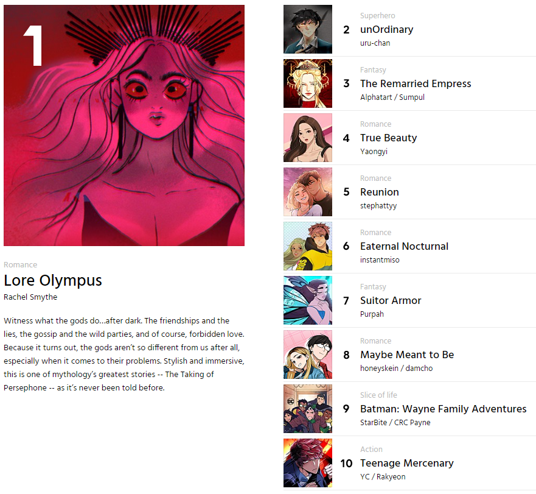
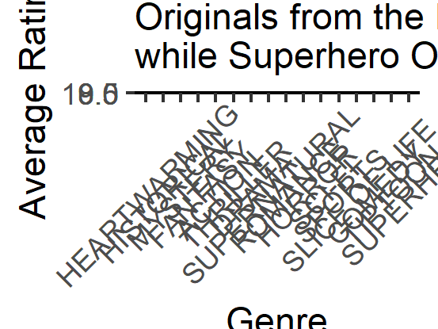
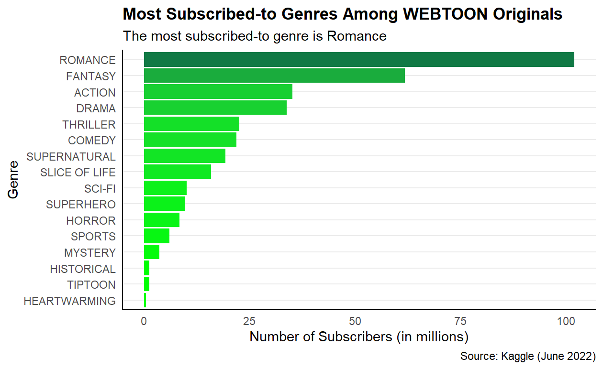

```{r setup, include=FALSE}
knitr::opts_chunk$set(echo = FALSE)

library(distill)
library(DT)
library(ggplot2)
library(gt)
library(janitor)
library(knitr)
library(plotly)
library(readxl)
library(rvest)
library(tidyverse)

# Note that the use of whitespace in the code below prevents various undesired formatting errors on the website
```

## **Metrics of Success**
Though cut-and-dry figures are not necessarily an indicator of a "good" WEBTOON, data analysis can identify patterns in Originals that statistically perform well among readers.

The follow metrics of success are compared to variables such as genre throughout this project:

* Number of subscribers
* Rating


As ranked by WEBTOON, the most popular Originals from genres are:


**Figure 1**


```{r popular_all_genres_image}

```
*Top Originals from all genres. (WEBTOON, 2022)*


**Table 1**


```{r originals_per_genre_table, echo=FALSE}
read_rds(file = "originals_per_genre.rds")
```
*(Kaggle, 2022)*


## Genres and Popularity
**Figure 2**
```{r genre_ratings_plot}

```


Note that the y-axis scale starts at 8.5 to emphasize the rating differences. Average series ratings are about the same for Originals across all genres, with Originals from the Heartwarming genre receiving the highest and Originals from the Superhero genre receiving the lowest.


**Figure 3**
```{r genre_subscribers_plot}

```


Romance wins by a landslide! How very romantic of you, WEBTOON readers. Fantasy comes second for number of subscribers, with Action and Drama at a close third and fourth.

Heartwarming ranking last in subscriber-based popularity, despite receiving the highest ratings, makes sense as there are only 2 Originals in the Heartwarming genre. (WEBTOON authors, do you see this unfulfilled market niche? 👀)


## Subscribers vs. Ratings
**Figure 4: Relationship between Subscribers and Ratings of WEBTOON Originals by Genre**

```{r subscribers_ratings_all_plot}
read_rds(file = "subscribers_ratings_all.rds")
```


**Figure 5: Relationship between Subscribers and Ratings of WEBTOON Originals**
```{r subscribers_ratings_genre_plot}
read_rds(file = "subscribers_ratings_genre.rds")
```


## **Conclusion**
Viewer ratings and subscriber counts prove that Romance and Fantasy Originals are the most popular.